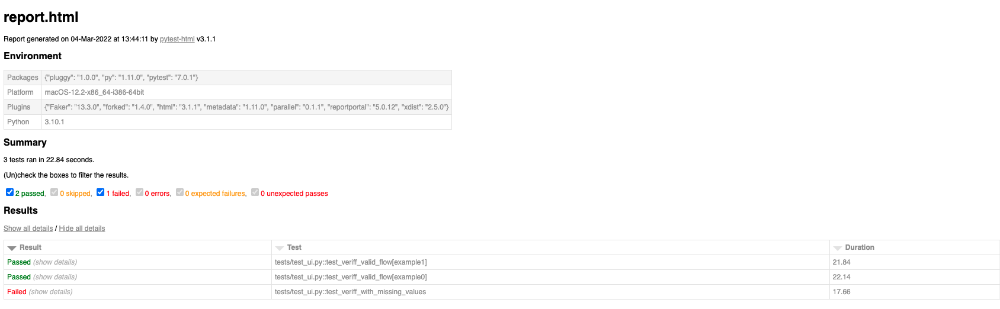

# Example QA Assessment

A real-world technical assessment from a company hiring QA / Software Testers.

## The Quality Engineer Test Task

Find the assessment instructions in this file: [quality-engineer-test.md](./qualiti-engineer-test.md)

> Give this a try yourself before looking at the solution in this repo!

## Setup

- 🐍 **_Python v3.8_** or higher is required
- 📦 **_Poetry_** as the package manager
- 👨🏽‍💻 Microsoft's Python extension installed in VSCode

1. Clone the repo

   ```bash
   git clone https://github.com/qa-at-the-point/api-testing-python.git
   ```

2. Install packages with Poetry

   ```bash
   # Installs all packages from pyproject.toml file
   poetry install

   # Then copy the path of the virtual environment
   poetry env info --path
   ```

3. Configure VSCode to use the proper virtual environment

   - Open Command Palette (`CMD + SHIFT + P` or `CTRL + SHIFT + P`)
   - Find and click `Python: Select Interpreter`
   - Paste the virtual environment path if it's not listed

## Run Tests

Examples and Recipes should include the instructions and commands to run the tests.
However, the base command is always the same:

```bash
# Run all tests
poetry run pytest
```

> 💡 The terminal will show test results and summary once the Test Run is complete

### Run UI Tests

```bash
poetry run pytest --html=report.html -n 3 tests/test_ui.py
```

- `--html` will create an HTML report that you can view in the browser
- `-n` specifies the number of tests to run in parallel
- `tests/test_ui.py` executes tests within the `test_ui.py` module

> Example of report.html


### Run API Tests

```bash
poetry run pytest --html=report.html -n 3 tests/test_api.py
```

## Submit a Bug or Request

If you've found an bug or you have an idea or feature request, please create an issue on the [Issues Tab](https://github.com/qa-at-the-point/example-qa-assessment/issues)
